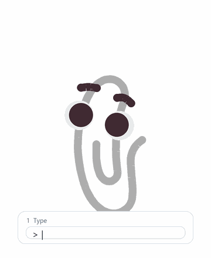
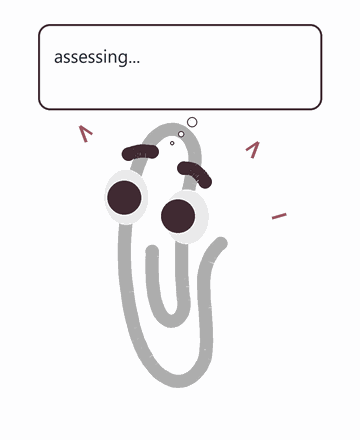
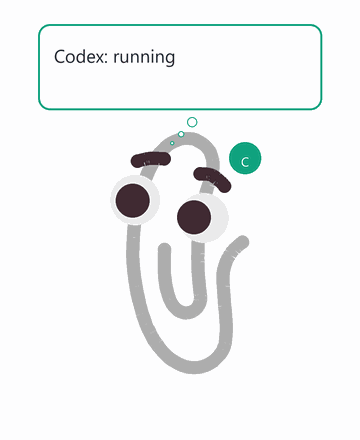

# Paperclip Pal

Paperclip Pal is a lightweight Windows desktop pet: a flat paperclip character
with reactive animations, status monitoring, local personality lines, and a
low-privacy sensing layer.

It is inspired by desktop assistant tropes, but it does not use Microsoft
Office Assistant assets or Microsoft Agent components. The character art is a
project-specific flat vector.

## Demo



The core interaction loop is: user types a prompt, the pal performs a visible
thinking/searching state while the local LLM works, then it replies with a
bubble and a small character performance.

## 技术亮点

- LLM 容错链：本地句库、Ollama、状态专用文案和安全降级共同保证夹夹能回应。
- 隐私模型：只采集明确开启的低敏状态源，默认避开键盘内容、剪贴板和聊天正文。
- 关键帧回归测试：动作 GIF 绑定签名，动画表改动后 CI 会提示重新生成演示资产。
- 零运行时依赖：桌宠主体使用 Python 标准库与 Tkinter，额外能力通过可选依赖开启。
- Win32 层：窗口置顶、拖拽、透明背景、任务栏隐藏和开机启动围绕 Windows 桌面体验打磨。

| Idle | Cold arrow | Sleepy |
|---|---|---|
|  |  |  |

| Status colors | Tail wag |
|---|---|
|  |  |

## Current Features

- Transparent, always-on-top Windows desktop pet.
- Drag to move, double-click to poke, right-click menu for actions and status.
- Flat vector paperclip body with layered eyes, pupils, brows, and tail.
- Procedural animation actions: blink, scan, wiggle, jump, spin jump, flop,
  dance, twirl, excited spin, stretch, sneeze, shiver, peekaboo, curious lean,
  sleepy sag, smug sway, tail wag, and more.
- Playful desktop movement: zoomies dashes, moonwalk slides, pounce leaps,
  hop relocations, and corner retreats — all clamped to stay on screen.
- Performance phrases such as `cold_arrow_then_innocent`,
  `suspicious_observe`, `fake_sulk`, and `tiny_celebrate`.
- Speech and thought bubbles with Codex/Claude/OpenAI/hardware accent colors.
- Activity presets: quiet, normal, active, and hyper.
- Optional local Ollama chat/reaction brain.
- Optional low-privacy monitors for Codex, Claude, hardware, and OpenAI API
  costs.

## Requirements

- Windows 11 is the primary target.
- Python 3.11+.
- Optional: `psutil` for CPU/RAM/disk metrics.
- Optional: NVIDIA `nvidia-smi` for GPU metrics.
- Optional: Ollama for local personality generation.

The app uses Tkinter and pure Python drawing. It does not need Electron,
Live2D, Office Assistant, or Microsoft Agent.

## Run

From the repository root:

```powershell
python -m python_pal.main
```

For a background-style launch on Windows:

```powershell
pythonw -B -m python_pal.main
```

Self-test without opening the desktop pet:

```powershell
python -m python_pal.main --self-test
```

Scripted animation/status demo:

```powershell
python -m python_pal.main --demo
```

## Character Direction

The character should stay simple:

- paperclip body
- large round eyes
- dark brows
- no mouth
- no hands or feet
- no gradients or complex shadows

Most personality should come from timing, eye movement, brow movement,
squash/stretch, pauses, and after-reactions.

Animation production rules live in
[`docs/ANIMATION_AUTHORING_GUIDE.md`](docs/ANIMATION_AUTHORING_GUIDE.md).

The base SVG is:

```text
python_pal/assets/paperclip/paperclip-pal-refined.svg
```

The asset is split into stable layer IDs:

- `body_wire`
- `left_eye_white`
- `right_eye_white`
- `left_pupil`
- `right_pupil`
- `left_brow`
- `right_brow`

## Privacy Model

Paperclip Pal is designed as a local-first desktop companion. It should observe
state, not private content.

By default, it does not read:

- clipboard text
- keystroke text
- passwords, tokens, or chat contents
- raw screen text
- full screenshot contents

See [PRIVACY.md](PRIVACY.md) for the detailed sensing and storage policy.

## Status Monitors

### Codex

Paperclip Pal can read local Codex rollout files under:

```text
%USERPROFILE%\.codex\sessions\...\rollout-*.jsonl
```

It reads only `token_count.rate_limits` and converts `primary.used_percent`
into a remaining percentage for the 5-hour window. It does not read Codex
message text.

If fresh rollout data is unavailable, it can use a local bridge file:

```powershell
.\scripts\set_codex_usage.ps1 26 5:22am
```

### Claude

Paperclip Pal can summarize local Claude Code token usage from:

```text
%USERPROFILE%\.claude\projects\...\*.jsonl
```

It reads only `message.usage`, model names, timestamps, and project names.
Claude local logs do not expose an official remaining quota percentage, so this
monitor reports token usage, not plan quota.

### OpenAI API Costs

Paperclip Pal can read OpenAI API organization costs from:

```text
https://api.openai.com/v1/organization/costs
```

Set one of these environment variables:

```powershell
[Environment]::SetEnvironmentVariable("OPENAI_ADMIN_KEY", "your-admin-key", "User")
```

The OpenAI Costs endpoint reports costs, not a wallet-style prepaid balance.
For prepaid tracking, provide a manual balance snapshot:

```powershell
[Environment]::SetEnvironmentVariable("OPENAI_API_PREPAID_BALANCE_USD", "10", "User")
[Environment]::SetEnvironmentVariable("OPENAI_API_PREPAID_BALANCE_SNAPSHOT_AT", "2026-06-05T00:40:00-07:00", "User")
```

Paperclip Pal will subtract official costs since that timestamp and report an
estimate.

### Hardware

The hardware watcher can sample:

- CPU usage, RAM usage, and disk usage through optional `psutil`
- NVIDIA GPU utilization, temperature, and VRAM through `nvidia-smi`

Hardware tint is temporary and should appear during relevant reminders or
manual checks, not as a permanent visual state.

## Local Chat And Ollama

The right-click menu includes a local chat entry. Simple status commands are
handled locally first. Optional Ollama calls can generate personality lines and
line-bank refills.

The local chat context is intentionally compact: status summaries, hardware
metrics, activity mode, app category, and recent pal lines. It should not
include raw screen text, clipboard text, keystrokes, or full screenshots.

## Action GIF Library

Every action has a rendered GIF in
[`docs/media/actions/`](docs/media/actions/README.md), useful for reviewing
timing and for sharing individual moves. They are drawn from the same keyframe
tables, easing curves, and pose math the live app uses, so they are not
hand-animated approximations.

Regenerate after adding, retiming, or removing any action:

```powershell
python scripts\generate_action_gifs.py
```

Verify the library is in sync without rewriting anything:

```powershell
python scripts\generate_action_gifs.py --check
```

`tests/test_action_gifs.py` runs that same check, so a keyframe edit without a
re-render fails the test suite.

## Generate Demo GIFs

The README hero and feature GIFs in `docs/media/` are generated from the same
flat character asset and `ACTION_FRAMES` definitions used by the app.

```powershell
python scripts\generate_demo_gifs.py
```

Both GIF scripts require Pillow:

```powershell
python -m pip install pillow
```

## Repository Layout

```text
python_pal/
  main.py                  app entry point
  body.py                  Tk desktop body, canvas drawing, animations
  animations.yaml          logical states and procedural performance phrases
  actions.py               visible action vocabulary
  soul.yaml                personality and behavior rules
  assets/paperclip/        base flat vector character asset
  assets/decorations/      small accessory references
  rig_pose.py              shared tail/inner-core pose math (runtime + renderer)
scripts/
  set_codex_status.ps1     local Codex status bridge helper
  set_codex_usage.ps1      local Codex usage bridge helper
  generate_demo_gifs.py    reproducible public GIF generator
  generate_action_gifs.py  per-action GIF library generator (--check to verify)
docs/media/
  *.gif                    generated animation demos for README
  actions/*.gif            one GIF per action, plus manifest.json and an index
```

## Local Runtime Files

These are intentionally ignored by git:

- `settings.json`
- `memory/`
- `codex_status.json`
- `codex_usage_status.json`
- `claude_account_status.json`
- `.env*`

Do not commit local usage data, account status snapshots, API keys, or memory
logs.

## License

Project code and original Paperclip Pal assets are released under the MIT
License. Imported IconPark decoration references remain under Apache-2.0; see
`python_pal/assets/decorations/iconpark/`.
