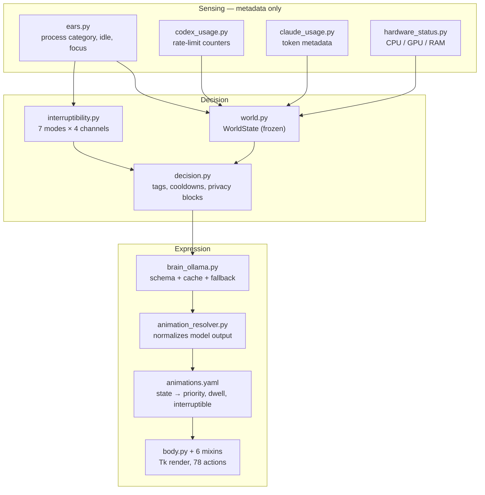

# Jiajia (夹夹)

**A privacy-aware behavior system for ambient AI agents.**

[](https://github.com/cloudinjun/jiajia/actions/workflows/ci.yml)


---

## The problem

Coding agents run for minutes at a time behind a scrolling log. While an agent
works, two things go wrong at once:

- **It is invisible.** You cannot tell whether the model is thinking, running a
  tool, stuck, waiting on you, or finished. So you keep checking.
- **When it does need you, it interrupts badly.** A permission prompt has the
  same weight as a completion notice, and both arrive while you are mid-sentence
  in a meeting.

The usual fixes make it worse. More notifications train you to dismiss them.
Richer status panels demand that you go look. And most "AI companion" products
buy legibility by reading your screen.

**How can an ambient agent make its internal state legible, ask for
intervention proportionately, and hold a coherent personality — without
becoming another notification system, and without reading private content?**

Jiajia is a working answer to that question. The desktop pet is the test
vehicle, not the point.

## Design thesis

Three commitments drive every decision in this repository:

1. **State is communicated through motion, not text.** If you have to read a
   label to know the agent is stuck, the design failed. Body language is
   ambient — it costs a glance, not a context switch.
2. **Interruption is a policy, not a side effect.** What the agent wants to say
   and whether you can be interrupted are separate axes, resolved explicitly.
3. **Legibility must not cost privacy.** The agent reads metadata — process
   category, idle time, rate-limit counters — never content. When a screen looks
   sensitive, the correct behavior is to go quiet, not to summarize.

## Three scenarios that define the system

### 1. Working → waiting for you

The agent is running tools. Jiajia patrols — low amplitude, no speech, easy to
ignore. When the agent needs a permission decision, the character leans toward
you, holds the request up, and *stops moving*.

The scheduling half of this works and is verified: `running_tool` is priority 22
and interruptible; `permission` is priority 45 and **not** interruptible, with a
2500 ms floor so it cannot be overwritten by a cheerful idle animation before
you have seen it.

The *legibility* half does not work yet. Blind-tested against ten vision models,
`permission_request` was recognized 0/10 — read as surprise, alertness or
focus, but never as a request for authorization. Wide eyes signal attention;
they do not signal asking. See [the study](#does-any-of-this-actually-read).

### 2. Error → inspect → explain → recover

A failure does not produce a red banner. It produces `error_autopsy`: the
character examines the problem, then reports it. Error is priority 50 — the
highest in the system — and holds for 2400 ms minimum.

The design claim was that an agent which *performs* diagnosis is more
trustworthy than one printing a stack trace, because the performance
communicates "I know what went wrong" before you read a word.

That claim failed its first test: 0/10 recognition, most often read as a slow
sleepy blink. The narrowing eyelids and gentle sway that were meant to read as
scrutiny read as drowsiness instead. The state machine is right; the motion
vocabulary is not.

### 3. Knowing when to disappear

The most valuable behavior in an ambient agent is restraint.
[`interruptibility.py`](jiajia/interruptibility.py) assesses seven modes and
returns four independent permission channels:

| Mode | Trigger | Speech | Animation | Badges |
|---|---|---|---|---|
| `meeting` | foreground app is chat/meeting | ✗ | ✗ | ✗ |
| `fullscreen` | foreground window is fullscreen | ✗ | ✗ | ✗ |
| `focus` | user enabled focus mode | ✗ | ✓ | ✓ |
| `quiet` | quiet timer running | ✗ | ✓ | ✓ |
| `sleep_hours` | 23:00–07:00 local | ✗ | ✓ | ✓ |
| `focused_input` | sustained typing in one work window | ✗ | ✓ | ✓ |
| `open` | none of the above | ✓ | ✓ | ✓ |

`focused_input` is inferred, not declared: 25+ seconds of focus, under 2.5 s
idle, fewer than 4 window switches per minute, in a work-category app. The agent
notices you are concentrating and lowers its own volume without being asked.

Every restrictive mode still sets `visual_only_critical`, so a genuinely urgent
state can reach you silently rather than being suppressed entirely.

## What I designed

The implementation is AI-assisted. The judgment is not. Concretely, I:

- Defined the behavior model — which agent states exist, what each one is
  allowed to do, and how they preempt one another.
- Designed the two-layer interruption architecture (state priority × user
  interruptibility) and its escalation rules.
- Set the privacy boundary as an allowlist and encoded it in the decision
  engine, so sensitive contexts silence the agent rather than being described.
- Authored the motion grammar: which semantic load sits on eyes, brows, body,
  tail, and props, and what each channel is *not* allowed to carry.
- Ran the design audits that removed features — props fell from 52/68 actions
  to 7/78 once I decided a prop must have a cause.
- Found the failures that green tests were hiding, and rewrote the tests to
  catch the real thing.
- Converted subjective animation rules into executable assertions.

The last two are the transferable skill: **I use AI to expand the solution
space, then build evaluation rules to decide what survives.**

Three worked examples, with before/after evidence:
[docs/DESIGN_DECISIONS.md](docs/DESIGN_DECISIONS.md)

## System architecture



The declarative core is [`animations.yaml`](jiajia/animations.yaml): 16 logical
states, 10 agent state visuals, 20 performance phrases and 8 state rules, each
carrying `priority`, `minimum_ms` and `interruptible`. Behavior is authored as
data; the runtime schedules and enforces it. Adding a state does not mean
writing scheduling code.

The LLM is optional and never trusted. [`brain_ollama.py`](jiajia/brain_ollama.py)
constrains output to a schema, and
[`animation_resolver.py`](jiajia/animation_resolver.py) maps hallucinated action
names back onto the real vocabulary. If Ollama returns malformed JSON, times
out, or is simply absent, the curated line bank serves the same interaction.
Offline is a supported mode, not a degraded one.

## Evaluation

123 tests across 11 suites, plus 183 scored behavior checks. The interesting
ones do not check functions — they check that design intent survives changes.

**Design-intent tests** ([`test_action_semantics.py`](tests/test_action_semantics.py))
turn the animation authoring guide into assertions:

```
test_blink_stays_a_blink
test_restful_actions_have_no_panic
test_quiet_companion_is_actually_quiet
test_no_two_agent_states_look_the_same
test_no_tail_gesture_outruns_the_frame_rate
test_only_the_tip_moves
```

**Localization contract** ([`test_english_no_chinese.py`](tests/test_english_no_chinese.py))
asserts English mode leaks no Chinese — across status summaries, prompts sent to
the model, seed banks, quiz dialogs and identity briefs. A missed translation
fails CI instead of shipping.

**Rendered-artifact regression** ([`test_action_gifs.py`](tests/test_action_gifs.py))
hashes keyframe data into a manifest. Retiming an action without re-rendering its
GIF fails the build, so the 78 published previews cannot drift from the code
that produces them.

**Fault injection** ([`test_brain_fallback.py`](tests/test_brain_fallback.py))
replaces the network seam and asserts one invariant across every way a local
model fails — refused connection, timeout, prose instead of JSON, a truncated
object, a leaked `<think>` block, wrong types, a hallucinated action name, the
wrong language. In all of them the pal still says something, and the action it
picked is one the renderer knows.

**Behavior evaluation set** ([`eval/`](eval/README.md)) — 183 checks over 114
annotated scenarios, scored on interruption appropriateness, privacy
compliance, semantic fit and recovery. Expectations are written from the design
intent rather than from the implementation, so a disagreement is a finding in
either direction. It found four dead entries in the alias table on its first
run.

### Does any of this actually read?

Everything above verifies that the system does what it was told to do. None of
it answers the question the whole design rests on: **when the character performs
a state, does anyone understand it?**

So I tested it. Ten vision models — seven local, three cloud — each saw four
anonymized animations stripped of their labels, with no candidate answers, and
reported their first reading. 40 independent judgments.

**The strict hit rate was 5%.**

| State | Recognized | Most common misreading |
|---|---:|---|
| `error_autopsy` | 0/10 | slow blink, sleepy, idle |
| `thinking_loop` | 1/10 | drowsy blink, idle, confused |
| `permission_request` | 0/10 | surprised, alert, focused |
| `waiting_stare` | 1/10 | dozing, asleep, low power |

The one `waiting` hit came from a model that answered "idle, waiting for input"
for *all four* stimuli, so it is response bias rather than discrimination.

The diagnosis is specific and fixable. All four states share the same
eye-open-squint-open grammar, so the differences between them are invisible.
`error` has no sharp negative signal. `thinking` borrows drowsiness's exact
vocabulary. `permission` has wide eyes, which say attention, not asking.
`waiting` closes its eyes long enough to read as sleep.

Method, per-model results and the proposed orthogonal motion grammar:
[docs/research/blind-animation-recognition-2026-08-27.md](docs/research/blind-animation-recognition-2026-08-27.md)

This is a proxy pre-screen, not a user study — vision models expose strong
ambiguity cheaply, but they are not people and a contact sheet is not playback.
The real bar is 5–8 human participants on the same protocol, with a target of
60% free recognition and 80% four-alternative forced choice.

I am keeping the negative result in this README rather than fixing the
animations first and reporting only the second number. The state machine was
right and the motion vocabulary was wrong, and I would rather show the test that
told me so.

## Demo

| Idle | Cold arrow, then innocent | Sleepy |
|---|---|---|
|  |  |  |

| Status colors | Tail wag |
|---|---|
|  |  |

All 78 actions have rendered previews in
[docs/media/actions/](docs/media/actions/README.md).

## Technical implementation

- **Zero required runtime dependencies.** Pure standard library — Tkinter for
  the window, hand-written SVG parsing, hand-written spring-damper physics.
  Comparable projects in this category ship Electron.
- **Procedural animation, not sprite sheets.** Keyframe tables plus a
  critically-damped spring ([`anim_physics.py`](jiajia/anim_physics.py)) drive
  squash, stretch and rebound. The same pose math
  ([`rig_pose.py`](jiajia/rig_pose.py)) serves the live app and the offline GIF
  renderer, so previews are the real thing.
- **Win32 via ctypes** for transparency, always-on-top, multi-monitor bounds and
  global cursor tracking, with no wrapper library.
- **22,869 lines across 52 modules.** `body.py` composes six mixins
  (`WindowMixin`, `CanvasMixin`, `ActionMixin`, `DecorMixin`, `PanelMixin`,
  `IdleMixin`) — down from a 9,562-line single class; the split is in the commit
  history.
- **Original character art.** Layered flat vector with stable layer IDs and a
  documented production guide
  ([`docs/ANIMATION_AUTHORING_GUIDE.md`](docs/ANIMATION_AUTHORING_GUIDE.md)).
  No Microsoft Office Assistant assets or Microsoft Agent components.

## Privacy

Jiajia observes state, not content.

**Never read:** clipboard text, keystrokes, passwords, chat contents, document
text, browser cookies, full screenshots.

**Read when enabled:** foreground app *category*, idle time, Codex local
rate-limit metadata, Claude local token metadata, hardware metrics, optional
OpenAI organization cost totals.

The boundary is enforced in code, not just documented:
[`decision.py`](jiajia/decision.py) carries `PRIVACY_TAGS`, and a
privacy-sensitive context silences the agent rather than producing a
description of it. Full policy: [PRIVACY.md](PRIVACY.md)

## Run locally

```powershell
python -m jiajia.main
```

Background launch, or self-test without opening the window:

```powershell
pythonw -B -m jiajia.main
python -m jiajia.main --self-test
```

Install, with optional extras:

```powershell
python -m pip install .
python -m pip install ".[media]"
python -m pip install ".[monitoring]"
```

Run the checks:

```powershell
python -m compileall -q jiajia scripts tests
python -m unittest discover -s tests
python eval\run_eval.py
python scripts\generate_action_gifs.py --check
python -m ruff check .
python -m mypy
```

## Repository map

```text
jiajia/
  main.py                  entry point
  body.py                  orchestration; composes the mixins below
  pal_window.py            Win32 and window placement
  pal_canvas.py            Tk drawing
  pal_actions.py           action dispatch and scheduling
  pal_motion.py            keyframes and motion tables
  pal_decor.py             decorations and costumes
  pal_idle.py              idle timers, gaze, blinking
  pal_panels.py            chat and quiz panels
  pal_geometry.py          shared constants and pure geometry

  world.py                 WorldState aggregation
  decision.py              reaction rules, cooldowns, privacy blocks
  interruptibility.py      interruption policy
  brain_ollama.py          optional LLM with schema, cache and fallback
  animation_resolver.py    normalizes model output to real actions
  line_bank.py             curated lines, caching, rotation

  animations.yaml          states, priorities, dwell times, phrases
  soul.yaml                personality and behavior rules
  locales/                 en_soul.yaml, seed banks
eval/                      behavior evaluation set
scripts/                   GIF generators and audits
docs/                      authoring guide, design decisions, media
```

## Local files

Ignored, and should stay private: `settings.json`, `memory/`,
`codex_status.json`, `codex_usage_status.json`, `claude_account_status.json`,
`openai_billing_status.json`, `.env*`, and raw AI concept exports under
`jiajia/assets/paperclip/`.

## License

Project code and original Jiajia assets are MIT licensed. Selected third-party
icon references keep their original notices in
[jiajia/assets/vendor/THIRD_PARTY_NOTICES.md](jiajia/assets/vendor/THIRD_PARTY_NOTICES.md).
