# Action GIF Library

Every action the pal can perform, rendered from the same keyframe tables,
easing curves, and pose math the live app uses.

Regenerate after changing any action:

```powershell
python scripts\generate_action_gifs.py
```

`full` = complete performance. `body` = body and expression shown, but the
action also uses runtime-only canvas props (paper, hat, cane). `expression`
= the action is carried by eyes, brows, tail, or inner core over an idle body.

## Mood

| Action | Preview | Coverage | Notes |
|---|---|---|---|
| `happy_bounce` | 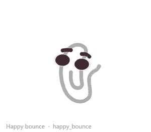 | full | 轻快弹两下，适合开心、赞同、发现好事。 |
| `dance` | 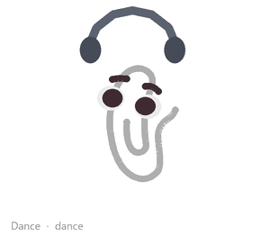 | full | 左右跳舞，适合得意、无聊自娱或庆祝。 |
| `celebrate` | 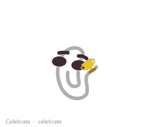 | full | 更夸张的小庆祝，适合完成任务或状态变好。 |
| `excited_spin` | 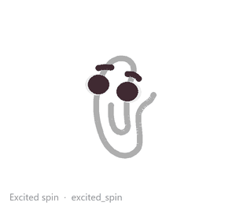 | full | 原地快速转两圈然后骄傲亮相，适合按捺不住的激动。 |
| `smug_sway` |  | full | 得意地小幅左右摆，适合毒舌后装无辜。 |
| `sulk` | 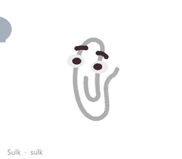 | full | 缩下去闷一下，适合小委屈、小嫌弃、小无语。 |
| `hide` | 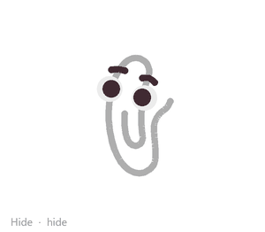 | full | 往下躲一躲，适合害羞、心虚、说完冷箭装无辜。 |

## State

| Action | Preview | Coverage | Notes |
|---|---|---|---|
| `thinking_tilt` | 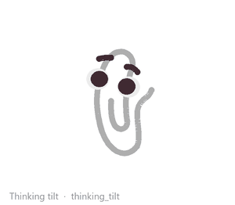 | full | 歪着想一想，适合思考和吐槽前的停顿。 |
| `sleepy_sag` | 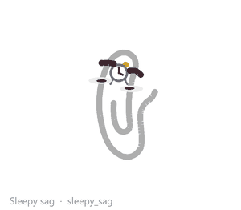 | full | 慢慢塌下去再恢复，适合困、无聊、加载太久。 |
| `flop` | 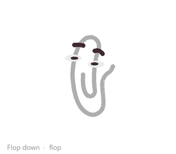 | full | 整只纸夹趴下，适合累了、无语、放弃一秒。 |
| `melt` | 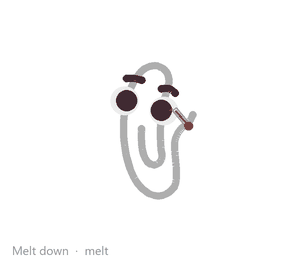 | full | Melt into a low readable puddle, hold for a beat, then recover; use for overload, embarrassment, or complete dramatic collapse. |
| `stretch` | 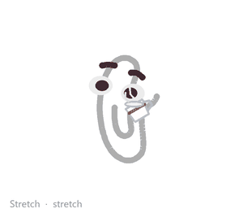 | full | 伸懒腰，适合从 idle 醒来或准备开工。 |
| `scan` | 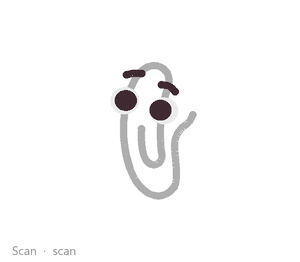 | expression | 眼睛左右扫视，适合监控、找东西、读屏幕状态。 |
| `patrol` | 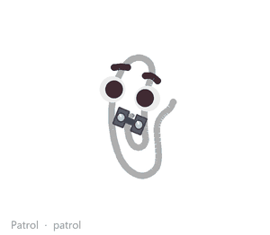 | full | 左右巡逻，适合等待、监控 Codex 或假装忙。 |
| `curious_lean` | 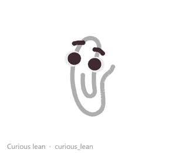 | full | 好奇地朝一侧探身拉长凑近看，适合发现新东西或偷看屏幕。 |
| `shiver` | 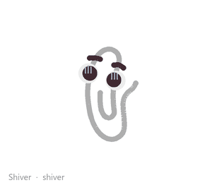 | full | 缩起来发抖再慢慢平静，适合冷、害怕或看到可怕的代码。 |

## Reactive

| Action | Preview | Coverage | Notes |
|---|---|---|---|
| `wiggle` | 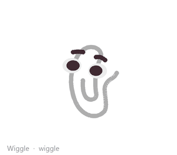 | full | 被戳或欠欠地抖一下，短促。 |
| `blink` | 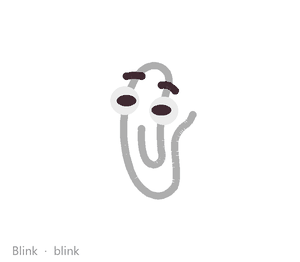 | expression | 睁大眼装无辜或轻轻眨眼。 |
| `peek` | 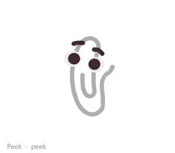 | expression | 眼睛偷瞄鼠标或屏幕角落，适合观察。 |
| `jump` | 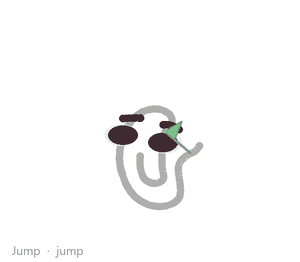 | full | 明显跳一下，适合开心或突然来劲。 |
| `spin_jump` | 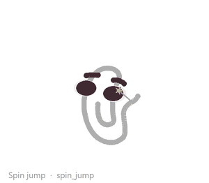 | full | 跳起并在空中转体一整圈再落地，适合特别兴奋或想炫技。 |
| `twirl` | 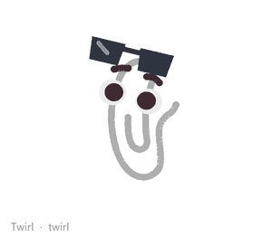 | full | 2D 水平翻转转身，适合装酷或一本正经胡说八道。 |
| `shake` | 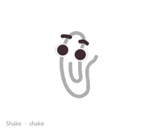 | full | 快速左右抖，适合紧张、报错、被吓到。 |
| `sneeze` | 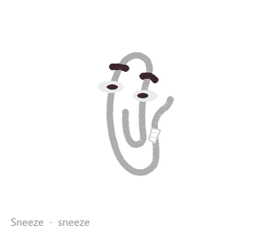 | full | 慢慢吸气仰起来，猛地打个喷嚏，再委屈地缓一下，适合灰尘、着凉、突发小事故。 |
| `peekaboo` | 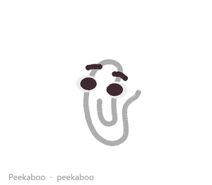 | full | 迅速躲下去憋一会儿，再猛地弹出来，适合逗用户或装神秘。 |
| `startled_pop` | 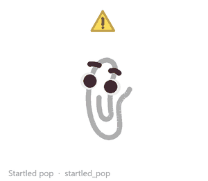 | full | 突然弹高又缩回，适合被戳、提示、意外状态。 |
| `tail_wag` | 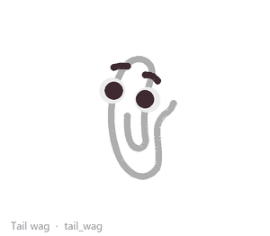 | expression | 把回形针右侧翘起的尾端轻轻甩两下，适合开心、得意、被逗到。 |
| `tail_tip_flick` | 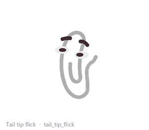 | expression | Quick tail-tip flick; use for impatience, suspicion, or a tiny opinion leaking out. |
| `tail_guilty_tuck` | 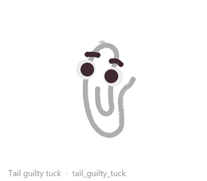 | expression | Tail tucks inward; use for fake innocence, guilt, or pretending nothing happened. |
| `tail_alert_snap` | 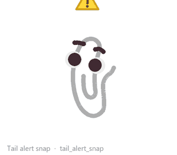 | expression | Tail snaps stiff then rebounds; use for warning, surprise, or sudden status changes. |
| `nod` | 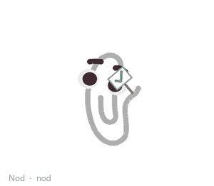 | full | 点头，适合确认、假装懂了、认真附和。 |

## Tail

| Action | Preview | Coverage | Notes |
|---|---|---|---|
| `tail_idle_slow` | 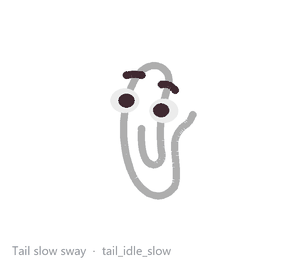 | expression | Slow, low-intensity tail sway; use for quiet companionship and subtle aliveness. |
| `tail_smug_sway` | 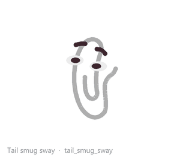 | expression | Slow smug tail sway; use after a dry roast or when the pal is pleased with itself. |
| `tail_sleepy_droop` | 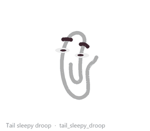 | expression | Tail droops softly; use for sleepy, bored, or waiting-too-long states. |
| `tail_frantic_innocent` | 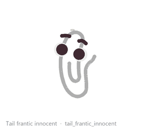 | expression | Short frantic tail betrayal; use when the pal is trying too hard to look innocent. |
| `tail_raise_excited` | 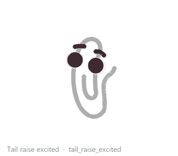 | expression | 尾巴竖直高举、梢部微颤，适合兴奋、打招呼、发现好事（猫式竖尾）。 |
| `tail_question_hook` | 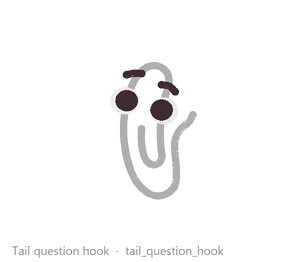 | expression | 尾巴弯成问号钩并保持，适合好奇、玩心起、歪着头研究东西。 |
| `tail_bristle` | 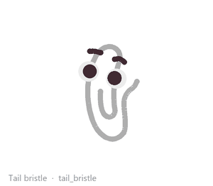 | expression | 尾巴僵直炸起并快速震颤，适合防御、警戒、被吓到但摆出架势。 |

## Inner

| Action | Preview | Coverage | Notes |
|---|---|---|---|
| `inner_cover_oops` |  | expression | Inner core swings toward the face like a tiny oops/cover-mouth gesture; never open like a mouth. |
| `inner_side_smirk` | 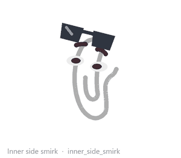 | expression | Inner core makes a small sideways smirk gesture; ambiguous between mouth-corner and hand. |
| `inner_shy_retract` | 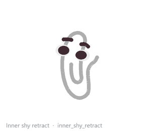 | expression | Inner core retracts inward like it has decided to stop incriminating itself. |
| `inner_droop` | 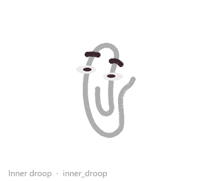 | expression | Inner core droops softly for sleepy, sulky, or low-energy states. |
| `oops_innocent_combo` | 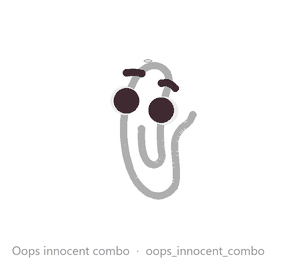 | expression | Signature post-roast act: inner cover-oops, darting innocent eyes, frantic tail betrayal. |

## Costume

| Action | Preview | Coverage | Notes |
|---|---|---|---|
| `britclip_enter` | 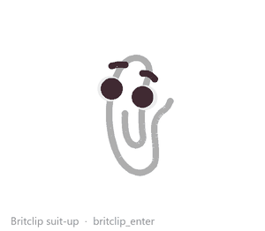 | body | Genderless British-inspired costume: tail produces a hat, bow tie, and cane, then holds the Britclip pose. |
| `britclip_exit` | 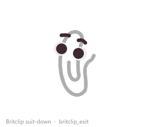 | body | Reverse the Britclip costume: cane away, bow tie folded, hat removed, then ordinary paperclip posture. |
| `tip_hat` |  | body | Tail-assisted hat tip for a polite oops or restrained English-mode acknowledgement. |
| `bow_tie_check` | 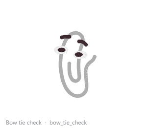 | body | Tiny costume-aware bow-tie adjustment; formal, neutral, and a little self-important. |
| `cane_tap` | 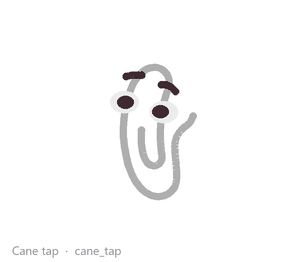 | body | Small cane tap for punctuation; restrained status or dry English-mode emphasis. |
| `polite_bow` | 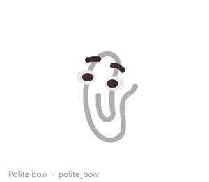 | full | A tiny formal bow; courtesy without gendered body language. |
| `hat_tip_oops` | 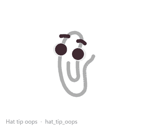 | body | Tail-assisted hat tip/removal for an oops beat; use after a polite roast in English mode. |

## Paper Props

| Action | Preview | Coverage | Notes |
|---|---|---|---|
| `paper_blanket` | 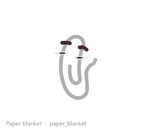 | body | Draft-paper blanket; use for sleepy, low-energy, or long-idle states. |
| `paper_surfboard` | 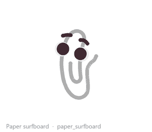 | body | Draft-paper surfboard; use for browser surfing, lively idle, or playful movement. |
| `paper_peek_curtain` | 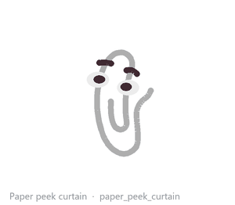 | body | Draft-paper curtain with only the eyes showing; use for spying, waiting, or fake innocence. |
| `paper_fan` |  | body | Folded draft-paper fan; use for heat, stress, or dramatic unimpressed cooling. |
| `paper_whisper_fan` |  | body | Open draft-paper fan in front of the mouth/inner core; use for the sharpest spoken roast, like polite gossip after a lethal sentence. |
| `paper_oops_cover` |  | body | Draft paper held in front of the face; use after a roast or when pretending not to have said anything. |
| `paper_tent` |  | body | Folded draft-paper tent; use for hiding, focus retreat, or dramatic avoidance. |
| `paper_pillow` |  | body | Draft-paper pillow; use for sleepy or floppy low-energy beats. |
| `paper_stage` |  | body | Draft-paper stage mat; use for dance, celebration, or tiny performance moments. |

## Movement

| Action | Preview | Coverage | Notes |
|---|---|---|---|
| `twist_scoot` |  | full | Small twist plus 10-20px scoot; frequent tiny reposition with attitude. |
| `mini_hop_shift` |  | full | Small hop shift of 20-50px with squash, arc, and rebound. |
| `relocate_hop` |  | full | Medium hop relocation with anticipation, landing squash, and rebound. |
| `zoomies` |  | full | 像猫发疯一样左右冲刺几趟带急刹，适合精力过剩。 |
| `moonwalk` |  | full | 面朝一边却往另一边滑走，滑到位再帅气转回来，适合得意退场。 |
| `pounce` |  | full | 压低身子扭两下蓄力，然后向前扑出一小段，适合盯上了什么东西。 |
| `roast_and_scoot` |  | full | Scoot away after a roast, then snap into fake innocence. |
| `retreat_to_corner` |  | full | Retreat toward a screen corner for quiet or self-restraint mode. |
| `drop_in` |  | full | Drop into the current station from above with a flat landing squash. |
