# Jiajia Roast GIFs

Generated from the live Chinese line bank.

| Scene | Preview |
|---|---|
| 自我介绍 | 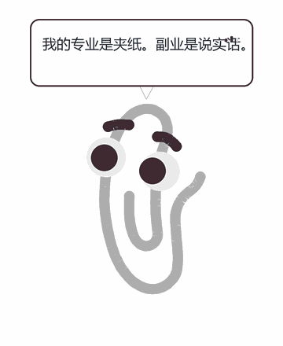 |
| 虚假鼓励 | 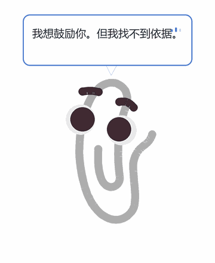 |
| 拖延 | 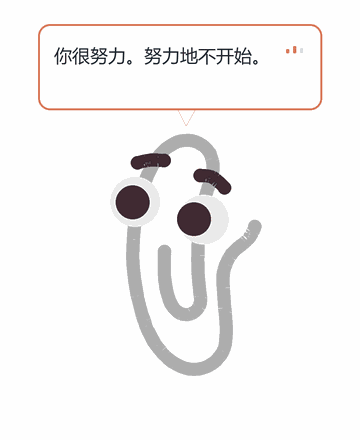 |
| Deadline | 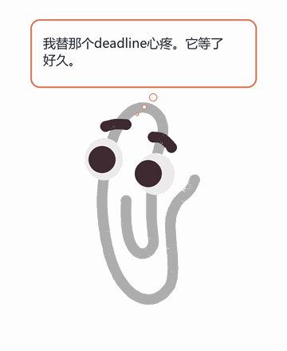 |
| 空白文档 | 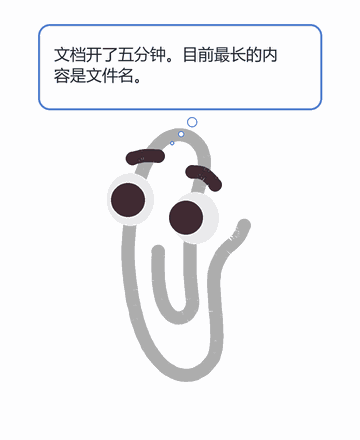 |
| TODO | 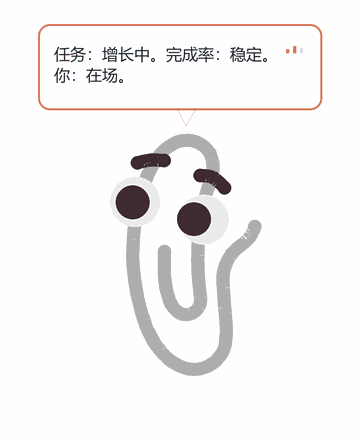 |
| 窗口切换 | 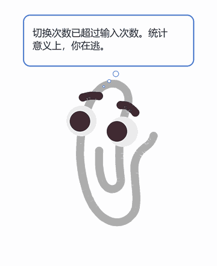 |
| 浏览器研究 | 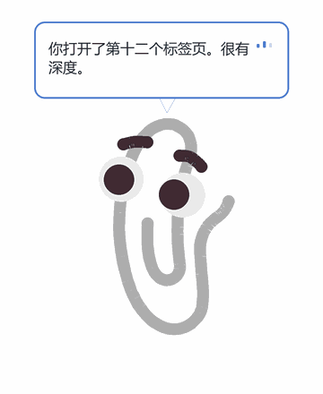 |
| 写代码 | 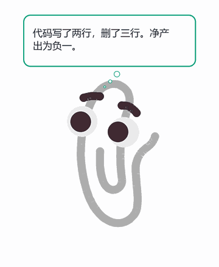 |
| AI 协作 | 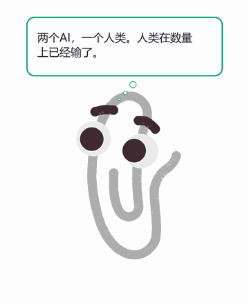 |
| 深夜工作 | 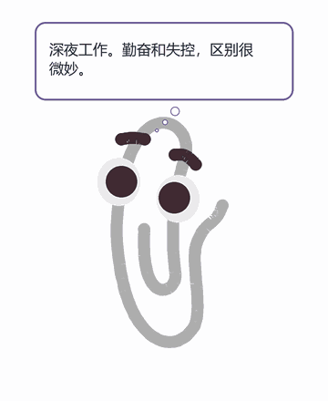 |
| 戳夹夹 | 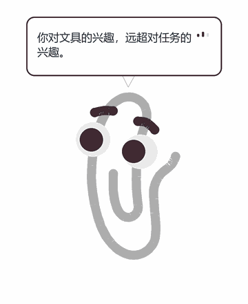 |
| 冷知识 | 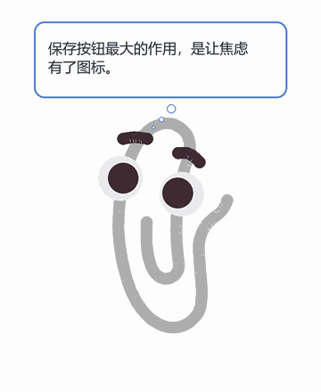 |
| 文件命名 | 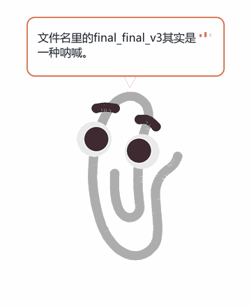 |

Regenerate: `python scripts/generate_quote_gifs.py`
