# Jiajia Roast GIFs — English

Generated from the live English line bank.

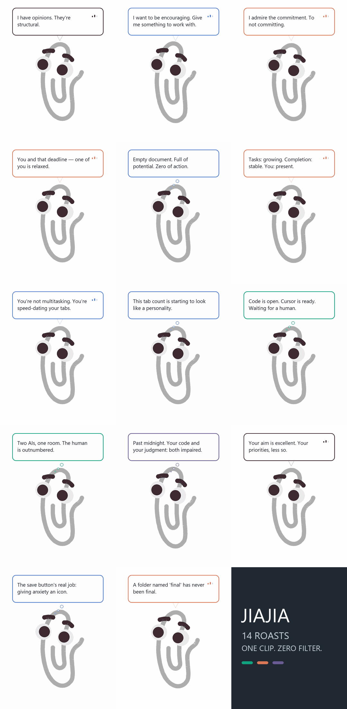

| Scene | Preview |
|---|---|
| Self-aware | 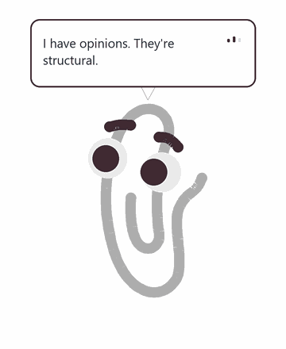 |
| Encouragement | 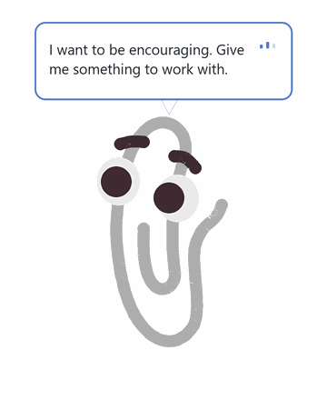 |
| Procrastination | 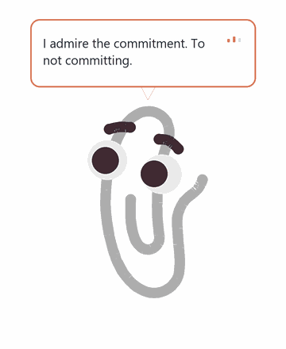 |
| Deadline | 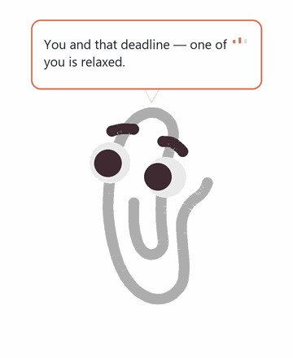 |
| Blank document | 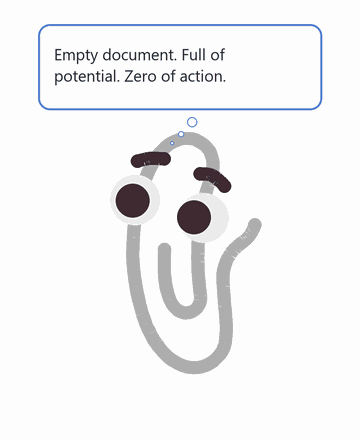 |
| TODO | 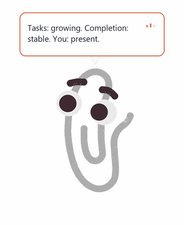 |
| Tab switching | 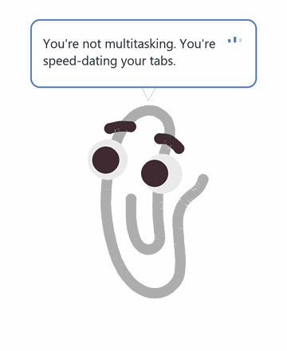 |
| Browser research | 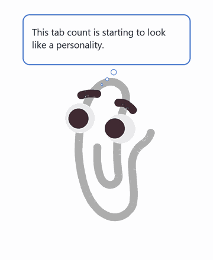 |
| Coding | 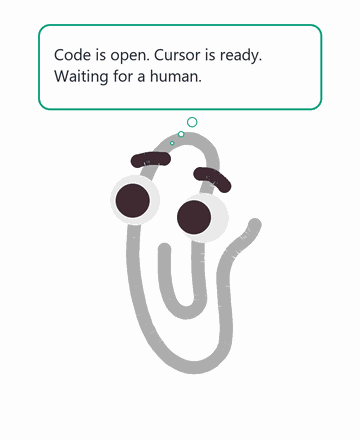 |
| AI collaboration |  |
| Late-night work | 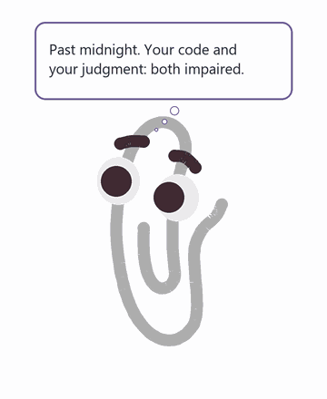 |
| Poke | 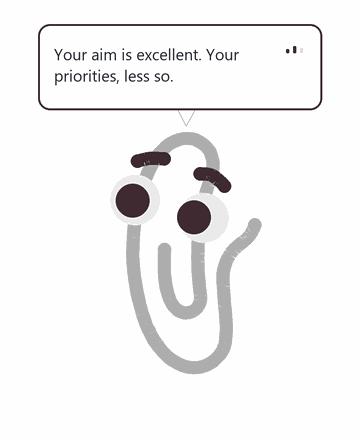 |
| Cold fact | 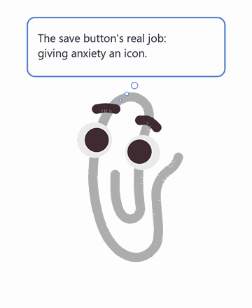 |
| File naming | 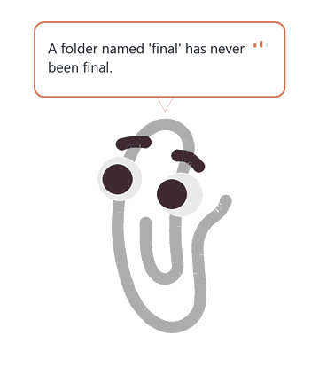 |

Chinese gallery: [Chinese](../README.md)

Regenerate: `python scripts/generate_quote_gifs.py --language en`
